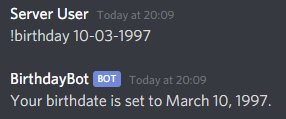
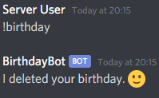
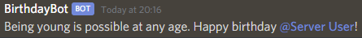

# Birthday Bot for Discord

A simple, lightweight and customizable birthday bot. No separate database required!

# Setup

1. Fill out the following variables in the `.env` file:
   - `BOT_TOKEN`: your Discord bot token
   - `BIRTHDAY_CHANNEL_ID`: the birthday channel ID where congratulatory messages should be sent to [(how do I get a channel ID from my server?)](https://support.discordapp.com/hc/en-us/articles/206346498-Where-can-I-find-my-User-Server-Message-ID)
   - `TRIGGER` _optional_: the prefix trigger for the birthday command (_Default: !birthday_)
2. `npm install`, `npm run postinstall` , `npm start`
3. Have fun! (Optionally you can host the bot with a service like Heroku.)

# Usage

## Setting a birthday

## Removing a birthday

## Celebrating!

The bot will check user birthdays every morning and when a new birthday is set.

# Customize Birthday Messages

Birthday messages can be added or modified in `./src/responses/birthdayChannel.json`.
